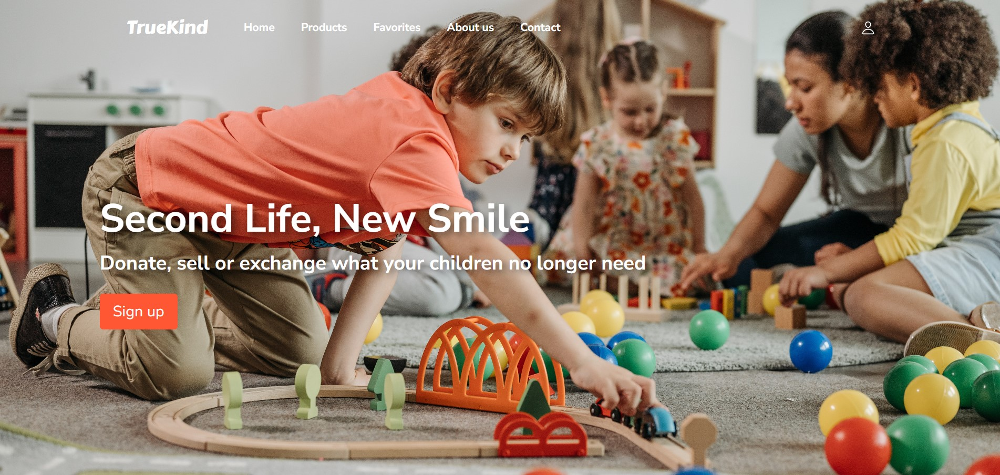
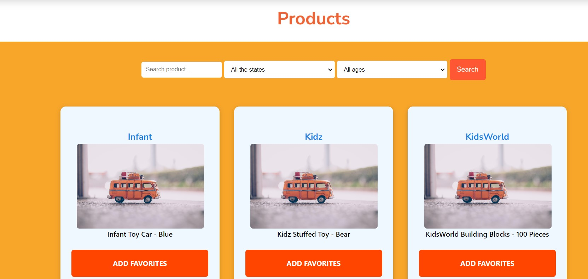
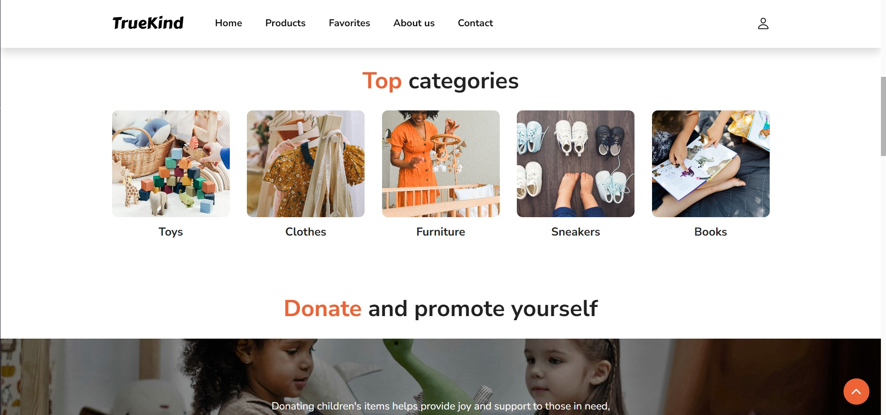
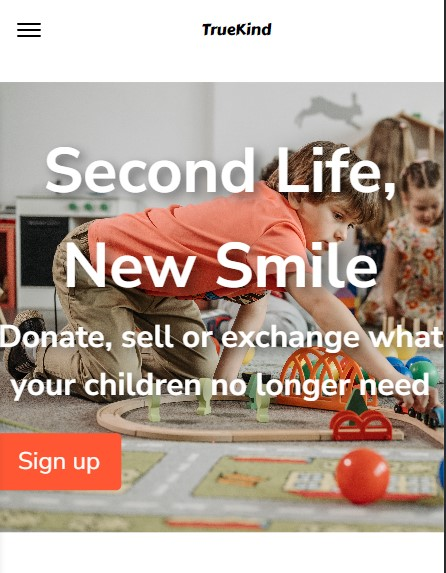
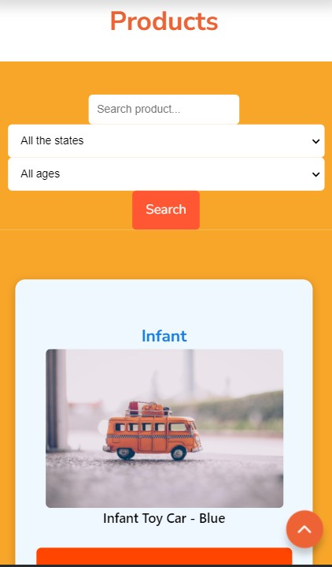
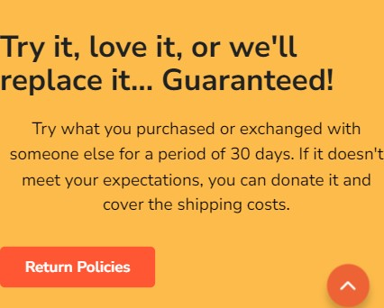

# TrueKind - Bringing Magic to Technology

## Introduction

Once upon a time, in a mysterious realm of technology, there was a magical company called TrueKind. It shone like a star in the night sky, where the most innovative and creative ideas came to life as magical solutions for the world. TrueKind was a digital castle, home to a group of intrepid developers, designers, and techies. Their glowing screens and magical keyboards brought amazing apps and websites to life, making people's lives easier and happier.

## The Haunted Library and JSON Files

At the heart of TrueKind was its haunted library, where the legendary JSON files resided. These mysterious files contained amazing secrets: the identification and names of enchanted items, along with other magical attributes that made each item unique and special. To share magic with the world, TrueKind needed a portal. So, with courage and skill, they decided to create their own website. Using the magic of JavaScript and the arts of programming, they made powerful HTTP requests to the JSON files.

## Enchanting the World with Data

As the JSON files opened like treasure chests, the hidden data revealed itself. One by one, the objects in the archive took shape on the web page. Each item appeared with its identification and name, along with other attributes that gave it life and meaning. People across the kingdom were amazed to see TrueKind's magic. The website glowed with the splendor of data, and every visitor was enchanted by the beauty and simplicity of the information displayed.

## Growing Magic and Impact

TrueKind's tales spread throughout the kingdom, inspiring more and more people to be a part of this wonderful world of technology. The company grew and prospered, bringing happiness and solutions to all who encountered its technological magic. TrueKind's story became a legendary tale that continues to inspire others to create and share their magic with the world. In this magical kingdom, where technology mixed with creativity and innovation, TrueKind left a shining imprint on the hearts of all who crossed its path.

## 💻 Tools and Technologies

TrueKind's magic was made possible by a blend of powerful tools and technologies, including:

 
    
    
    
&emsp;
    
&emsp;
    
&emsp;
     
     

## 🛠 Work Process

To bring TrueKind's magic to life, the team followed this work process:

- Requirements Analysis
- Mockup Analysis and Component Identification
- Visual Design Analysis
- Setup: Installing Laravel, Docker, and other required dependencies
- File Organization: Structuring the project based on components and other design principles
- Creating Routes: Setting up routes in the Laravel application
- Development: Starting development for each part of the project, focusing on frontend (HTML, CSS, JavaScript) and backend (Laravel) implementation.

## 🧡 Donate and Support

## 🔗 Links

- [Figma Design](https://www.figma.com/file/wdCTcOktQk00FJBG19TSRR/Untitled?type=design&node-id=37%3A103&mode=design&t=JLOdK90ufDrAsIBM-1)

---

### Desktop

#### Home

#### Products

#### Categories

#### Guarantee

### Mobile

#### Home

#### Products

#### Categories

#### Guarantee

## 🙏 Acknowledgements

We want to express our heartfelt gratitude to each member of the team who has contributed to this magical project. Your dedication, skills, and effort have been instrumental in bringing TrueKind to life and making it possible to share our magic with the world.

Special thanks to:

- [@Khodac](https://github.com/Khodac)
- [@yzadeveloper](https://github.com/yzadeveloper)
- [@Ninetthe](https://github.com/Ninetthe)
- [@mariene33](https://github.com/mariene33)
- [@NacylaM](https://github.com/NacylaM)
- [@OrzeFox](https://github.com/OrzeFox)
- [@LibertadLorda](https://github.com/LibertadLorda)
- [@mcefen](https://github.com/mcefen)
- [@Fer-gi](https://github.com/Fer-gi)

Your magic has left a brilliant mark on this project and in the hearts of everyone who has crossed its path!
